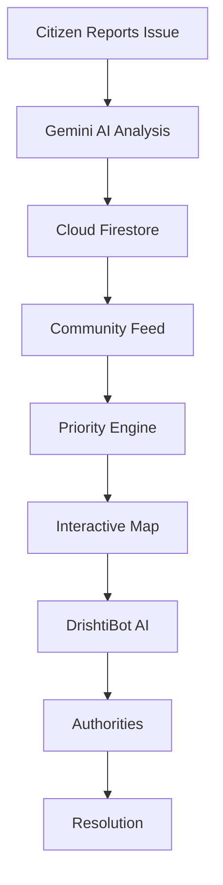

<div align="center">

# 🌍 CivicPulse AI
[🚀 Live Demo](https://civicpulse-ai-81317196678.asia-southeast1.run.app) • [📖 Documentation](#-installation) • [🐞 Report Issue](https://github.com/anubhawverma2009-oss/CivicPulse/issues) • [⭐ GitHub](https://github.com/anubhawverma2009-oss/CivicPulse)

**Empowering Communities Through Hyperlocal Civic Action**

[](https://civicpulse-ai-81317196678.asia-southeast1.run.app)
[](LICENSE)
[](https://react.dev)
[](https://www.typescriptlang.org)
[](https://ai.google.dev)

**Vibe2Ship 2026 Hackathon Submission** | Problem Statement: *Community Hero – Hyperlocal Problem Solver*

</div>

---

## 📋 Table of Contents

- [Overview](#-overview)
- [Architecture](#-architecture)
- [Problem Statement](#-problem-statement)
- [Solution](#-solution)
- [Why CivicPulse AI](#-why-civicpulse-ai)
- [Core Features](#-core-features)
- [Screenshots](#-screenshots)
- [How to Access](#-how-to-access)
- [Complete User Journey](#-complete-user-journey)
- [Technology Stack](#-technology-stack)
- [Google Technologies](#-google-technologies)
- [Installation](#-installation)
- [Environment Variables](#-environment-variables)
- [Project Structure](#-project-structure)
- [Security](#-security)
- [Deployment](#-deployment)
- [Demo Guide](#-demo-guide-for-judges)
- [Future Scope](#-future-scope)
- [Technical Innovations](#-technical-innovations)
- [Known Limitations](#-known-limitations)
- [License](#-license)

---

## 🎯 Overview

**CivicPulse AI** is a hackathon MVP — a fully functional demonstration prototype of an AI-powered civic engagement platform that aims to transform how communities solve local infrastructure problems. Citizens report civic issues through photo upload, Gemini AI analyzes and suggests a category and severity, community members verify through voting, and local authorities can track progress transparently.

The platform bridges the critical gap between citizens and local authorities through intelligent automation, community consensus verification, and real-time transparency—enabling faster problem resolution and stronger civic accountability.

### Key Stats

- **Status**: Hackathon MVP – Fully Functional Demonstration Prototype
- **Deployment**: Google Cloud Run (Auto-scaling)
- **Database**: Cloud Firestore (Real-time Sync)
- **AI Engine**: Gemini 1.5 Flash API
- **Live URL**: https://civicpulse-ai-81317196678.asia-southeast1.run.app

---

## 🏗️ Architecture



---

## 🔴 Problem Statement

### The Challenge

India's cities struggle with persistent civic infrastructure problems:

|
 Problem 
|
 Impact 
|
|
---------
|
--------
|
|
**
Potholes & Road Damage
**
|
 Accidents, vehicle damage, safety hazards 
|
|
**
Non-Functional Streetlights
**
|
 Nighttime safety risks for pedestrians 
|
|
**
Garbage Accumulation
**
|
 Health & sanitation crises 
|
|
**
Water Leakage
**
|
 Resource wastage & property damage 
|
|
**
Slow Response Times
**
|
 Issues remain unresolved for weeks/months 
|
|
**
Lack of Transparency
**
|
 Citizens can't track resolution status 
|
|
**
Poor Documentation
**
|
 No systematic issue tracking 
|
|
**
Communication Gap
**
|
 No direct citizen ↔ authority channel 
|
|
**
Zero Accountability
**
|
 No public pressure on authorities 
|

### Root Causes

- ❌ Citizens lack accessible reporting mechanism
- ❌ No automated issue categorization
- ❌ No community participation system
- ❌ Authorities isolated from citizen feedback
- ❌ No accountability for resolution timelines

---

## ✨ Solution

### How CivicPulse AI Solves It

**🤖 AI-Powered Analysis**
Photo Upload → Gemini Vision Analysis → Auto-Categorization
→ Severity Scoring (1-10) → Professional Description

- Automatically detects issue type (Pothole, Garbage, Streetlight, Water Leak, etc.)
- Gemini analyzes the uploaded image together with the available report context to estimate issue category, generate descriptions and assist with severity estimation
- Generates formal description in professional language
- Confidence scoring for quality assurance

**👥 Community Verification**
Issue Posted → Community Voting → 80% Consensus
→ Legitimate Confirmation OR Mark Resolved

- Citizens collectively verify issue authenticity
- "Yes, it's there" vs "No, it's fixed" voting
- Prevents false reports through collective intelligence
- Real-time vote counting

**🗺️ Real-Time Tracking**
Report → In Progress → Resolution Proof → Community Re-Verify
→ Auto-Mark Resolved

- Firebase provides instant updates to all users
- Transparent authority response timelines
- Before/after photo comparison for resolved issues
- Public pressure through visibility

**📍 Geographic Awareness**
Leaflet Map + OpenStreetMap Tiles → Issue Pins
→ Color-Coded by Severity

- Issues pinned to exact location coordinates
- Red = Critical (8-10), Orange = Warning (5-7), Green = Low (1-4)
- One-click access to issue details from map
- Works perfectly on all devices

**🎮 Gamified Engagement**
Participation → Civic Score Points → Badges Earned
→ Leaderboard Ranking

- Points for reporting, voting, resolving issues
- Achievement badges (First Reporter, Truth Seeker, Landmark Maker)
- Weekly/monthly leaderboards by locality
- Incentivizes community involvement

**🤖 24/7 AI Assistance**
User Question → DrishtiBot AI → Contextual Response

- Answers civic questions anytime, anywhere
- Understands English & Hindi
- Context-aware about local issues
- Fallback responses if backend offline

---

## 💡 Why CivicPulse AI

### Key Differentiators

| Aspect | Traditional | CivicPulse AI |
|--------|------------|---------------|
| **Reporting** | Manual text submission | AI photo analysis + auto-categorization |
| **Verification** | Authorities decide alone | Community consensus (80%+ votes) |
| **Prioritization** | Manual assessment | AI scoring + community votes |
| **Transparency** | None or minimal | Full real-time tracking |
| **Engagement** | Passive citizens | Gamified, rewarded participation |
| **Speed** | Weeks/months | Days/hours via community pressure |
| **Communication** | One-way (authority→citizen) | Two-way (citizen↔authority) |
| **Accountability** | Low/none | High (transparent & verified) |
| **Scalability** | Limited | Serverless, auto-scaling architecture |

---

## 🌟 Core Features

### 🎥 AI-Assisted Issue Reporting
Citizens upload photos of civic problems. Gemini AI analyzes the image in real-time and auto-fills category, severity score, and professional description. Users add title and comments, then submit with one click.

### 🏷️ Smart Categorization
Automatic AI classification: Pothole, Garbage, Streetlight, Water Leakage, Footpath Damage, Traffic Issues. Severity scoring (1-10) is estimated by Gemini based on the visual context available in the uploaded photo.

### 📰 Community Issue Feed
Real-time feed showing all civic issues in your area. Display: photo, AI description, severity badge, vote count, status (Pending/In Progress/Resolved). Sortable by recency or urgency. Filter by category.

### 🗳️ Community Verification Voting
Citizens vote: "✅ Yes, it's there" (confirms) or "❌ No, it's fixed" (reports resolution). Majority consensus determines action. 80%+ "Yes" = Issue confirmed. 80%+ "No" = Issue marked resolved. Prevents false reports through collective wisdom.

### 🗺️ Interactive Map (Leaflet + OpenStreetMap)
Geographic visualization of all civic issues. Issues pinned by exact coordinates. Color-coded by severity. Click pin → view full details. Your location shown as blue marker. Fully responsive on mobile/tablet/desktop.

### 📊 Issue Tracking Dashboard
Monitor status: Pending → In Progress → Resolved. Real-time updates via Firebase. Comments section for community discussion. Authority response timeline visible. Before/after photo comparison.

### 🏆 Leaderboard System
Issues ranked by urgency and time pending. Three views: Daily, Weekly, Monthly. Highlights chronic issues (10+ days unresolved). Public visibility motivates faster authority response.

### 📈 Impact Dashboard
Statistics: Total issues reported, verified, resolved. Completion percentage by locality. Top contributors. Community progress visualization.

### 🤖 DrishtiBot AI Assistant
Context-aware chatbot specialized in civic issues. Responds to queries about potholes, streetlights, garbage, water, badges, engagement. Works in English & Hindi. Available 24/7.

### 🎁 Rewards & Gamification
Earn Civic Score points for participation. Unlock badges: First Reporter, Truth Seeker, Neighborhood Guard, Landmark Maker. Weekly leaderboards with tier ranks (Bronze/Silver/Gold/Platinum).

### 🔐 Secure Authentication
Google OAuth Sign-In: One-click login with any Google account. Role-based access: Citizen vs. Local Authority workflows. First-time onboarding: Select role and locality.

### 📱 Fully Responsive Design
Optimized for mobile (320px), tablet (641px), desktop (1024px+). Identical feature parity across all devices. Touch-friendly interface on mobile. Desktop: 2-column layout with sidebar.

---

## 📸 Screenshots

### Login


### Community Feed


### Priority Issues


### Issue Map


### DrishtiBot AI


### Reward Store


### Profile


---

## 🚀 How to Access

### Step 1: Open Application
Visit: https://civicpulse-ai-81317196678.asia-southeast1.run.app


### Step 2: Sign In with Google (Recommended)
1. Click **"Sign in with Google"** button
2. Judges can sign in using any valid Google Account
3. If 2FA enabled: complete verification
4. Click **"Allow"** when app requests permissions

### Step 3: Complete Onboarding (First Login Only)
1. Select role: **"Citizen"** (full feature access)
2. Select locality: Kanpur, Varanasi, Lucknow, Prayagraj, etc.
3. Click **"Enter CivicPulse"**

### Step 4: Dashboard Opens
Dashboard displays:
- **Left**: Navigation & Civic Score
- **Center**: Community Issue Feed
- **Right**: DrishtiBot Chat

✅ **You're ready to explore!**

---

## 📍 Complete User Journey

### Stage 1: Report Issue (5 mins)

**User Action**:
1. Click blue **"Report Issue"** button
2. Select photo from camera or gallery
3. Wait for AI analysis (2-3 seconds)
4. AI auto-fills: Category, Severity Score (1-10), Professional Description
5. Add title: *"Large pothole at market crossing"*
6. Click **"Submit Report"**

**AI Magic**:
- Gemini analyzes the uploaded image together with the available report context
- Detects problem type automatically
- Estimates severity based on the visual context available in the photo
- Generates formal description

**Result**: Issue appears in community feed + on map instantly

---

### Stage 2: Verify Issue (Ongoing)

**Community Action**:
1. See new issue in feed with AI description
2. Review severity score and photo
3. Vote: **"✅ Yes, it's there"** (confirms) or **"❌ No, it's fixed"** (resolved)
4. Vote count updates in real-time
5. Read/write comments

**Verification Logic**:
- 80%+ "Yes" votes = Issue confirmed
- 80%+ "No" votes = Issue marked resolved
- Prevents false reports via collective consensus

**Citizen Reward**:
- +5 Civic Score points per verified vote
- "Truth Seeker" badge after 5 votes

---

### Stage 3: Track Progress

**Real-Time Updates**:
- Issue ranks on leaderboard
- Status: "Pending" (waiting for authority)
- Map displays with severity color
- Authority receives notification
- Community sees response timeline

**Public Accountability**: All citizens monitor progress. Authority transparency enforced.

---

### Stage 4: Authority Resolves

**Authority Workflow**:
1. Receives notification of high-priority issue
2. Assigns repair crew
3. Updates status: **"In Progress"**
4. Completes repair
5. Uploads resolution proof photo
6. Updates status: **"Awaiting Verification"**

**Community Re-Verification**:
1. Original voters receive notification
2. Vote: **"✅ Problem solved"** or **"⏳ Still pending"**
3. 80%+ "Solved" = Auto-mark **"Resolved"**
4. Issue becomes permanent **"Landmark"** (community achievement)

---

### Stage 5: Earn Rewards

**Points System**:
- Report confirmed issue: **+25 points**
- Vote on poll: **+5 points**
- Resolution vote: **+10 points**
- Helpful comment: **+5 points**
- Authority resolves your issue: **+50 points**

**Badges Earned**:
- 🔍 **First Reporter**: Report 1 issue
- ✅ **Truth Seeker**: 5 verified votes
- 🏘️ **Neighborhood Guard**: 10 issues reported
- 🌟 **Landmark Maker**: 1 issue resolved
- 🏆 **Civic Champion**: 50+ points

**Leaderboard Ranking**: Weekly rankings by Civic Score. Tier progression: Bronze → Silver → Gold → Platinum.

---

## 🛠️ Technology Stack

### Frontend
| Technology | Purpose | Version |
|-----------|---------|---------|
| React | UI Framework | 18+ |
| TypeScript | Type Safety | 5.0+ |
| Vite | Build Tool | 5.0+ |
| Tailwind CSS | Styling | 3.0+ |
| Framer Motion | Animations | 10.16+ |
| Lucide Icons | Icon Library | Latest |

### Backend & Services
| Service | Purpose |
|---------|---------|
| Firebase Auth | Authentication & OAuth |
| Cloud Firestore | Real-time Database |
| Firebase Storage | Photo & Document Storage |

### AI & Mapping
| Technology | Purpose |
|-----------|---------|
| Gemini 1.5 Flash | Image Analysis & NLP |
| Leaflet | Interactive Maps |
| OpenStreetMap | Free Map Tiles |

### Deployment
| Platform | Purpose |
|----------|---------|
| Google Cloud Run | Serverless Hosting |

---

## 🔵 Google Technologies Used

### 🤖 Gemini API
- **Vision Analysis**: Detects issue type from user photos
- **Severity Estimation**: Estimates severity based on the visual context available in the uploaded image
- **Description Generation**: Creates formal issue descriptions
- **DrishtiBot Responses**: Powers AI chatbot with context awareness

### 🔑 Firebase Suite
- **Authentication**: Secure Google OAuth + Email login
- **Cloud Firestore**: Real-time database with live listeners
- **Firebase Storage**: Secure image storage with CDN
- **Security Rules**: Role-based access control

### 🗺️ Mapping
- **Leaflet**: Interactive map library
- **OpenStreetMap**: Free, open-source map tiles
- **Browser Geolocation API**: Auto-detect user location
- **Coordinate System**: Latitude/Longitude precision

### ☁️ Google Cloud Run
- **Serverless Deployment**: Auto-scaling hosting
- **Environment Variables**: Secure credential management
- **Managed Infrastructure**: Benefits from Google Cloud's managed availability

---

## 💻 Installation

### Prerequisites
- Node.js 18+
- npm or yarn
- Git
- Gemini API Key ([Get Free](https://aistudio.google.com))
- Firebase Project ([Setup](https://console.firebase.google.com))

### Step 1: Clone Repository
```bash
git clone https://github.com/anubhawverma2009-oss/CivicPulse.git
cd civicpulse-ai
```

### Step 2: Install Dependencies
```bash
npm install
```

### Step 3: Setup Environment Variables
```bash
cp .env.example .env.local
```

Edit `.env.local` and add your credentials (see [Environment Variables](#-environment-variables))

### Step 4: Run Development Server
```bash
npm run dev
```

Open **http://localhost:5173** in your browser

### Step 5: Build for Production
```bash
npm run build
npm run preview
```

---

## 🔐 Environment Variables

Create `.env.local` file with:

```env
# Gemini API
VITE_GEMINI_API_KEY=your_gemini_api_key_here

# Firebase Configuration
VITE_FIREBASE_API_KEY=your_firebase_api_key
VITE_FIREBASE_AUTH_DOMAIN=your_project.firebaseapp.com
VITE_FIREBASE_PROJECT_ID=your_project_id
VITE_FIREBASE_STORAGE_BUCKET=your_project.appspot.com
VITE_FIREBASE_MESSAGING_SENDER_ID=your_sender_id
VITE_FIREBASE_APP_ID=your_app_id
```

### Getting Keys

**Gemini API**: [https://aistudio.google.com](https://aistudio.google.com)
**Firebase**: [https://console.firebase.google.com](https://console.firebase.google.com)

### Security Note
⚠️ Never commit `.env.local` to Git. Add to `.gitignore`:
.env.local
.env


---

## 📁 Project Structure

```
civicpulse-ai/
├── src/
│   ├── components/        # React components (Feed, Map, DrishtiBot, Leaderboard, Profile, Auth)
│   ├── firebase/          # Firebase setup & utils
│   ├── lib/                # Helpers & data utilities
│   ├── types.ts            # TypeScript interfaces
│   ├── App.tsx              # Main app component
│   └── main.tsx              # React entry point
├── public/                 # Static assets
├── firestore.rules          # Firestore security rules
├── .env.example              # Environment template
└── package.json               # Dependencies
```


---

## 🔒 Security

- **Google Authentication** for user sign-in
- **Firebase Authentication** for session management
- **Firestore Security Rules** to control data access
- **HTTPS** enforced on all connections
- **Role-based Access** for Citizen vs. Authority workflows

---

## 🚀 Deployment

### Deploy to Google Cloud Run

#### Step 1: Authenticate
```bash
gcloud auth login
gcloud config set project YOUR_PROJECT_ID
```

#### Step 2: Build Application
```bash
npm run build
```

#### Step 3: Deploy
```bash
gcloud run deploy civicpulse-ai \
  --source . \
  --platform managed \
  --region asia-southeast1 \
  --allow-unauthenticated
```

#### Step 4: Set Environment Variables
```bash
gcloud run services update civicpulse-ai \
  --update-env-vars \
  VITE_GEMINI_API_KEY=your_key,\
  VITE_FIREBASE_PROJECT_ID=your_id
```

#### Step 5: Verify Deployment
```bash
gcloud run services list
# Your live URL will be displayed
```

---

## 📊 Demo Guide for Judges

**Complete Demo: 8-10 minutes**

### 1️⃣ Login (1 min)
- Open: https://civicpulse-ai-81317196678.asia-southeast1.run.app
- Click **"Sign in with Google"**
- Judges can sign in using any valid Google Account
- Complete onboarding: Select "Citizen" role, choose any locality
- Note: Onboarding appears only once during the first login

### 2️⃣ View Feed (2 mins)
- See homepage with issue feed
- Scroll through civic issues
- Notice AI descriptions, severity scores (red/orange/green)
- Click issue to expand details
- Show voting interface

### 3️⃣ Open Map (1.5 mins)
- Click "Map" tab
- See issues pinned by location
- Notice color-coding (red=critical, orange=warning, green=low)
- Click pins to view details

### 4️⃣ Test DrishtiBot (1.5 mins)
- Open DrishtiBot chat panel (right sidebar)
- Ask: "What potholes are pending?"
- AI responds with relevant issues
- Ask: "How do I earn badges?"
- AI explains gamification

### 5️⃣ Create Report (2 mins)
- Click **"Report Issue"** button
- Upload photo or use test image
- Wait for AI analysis (2-3 seconds)
- Notice auto-filled: Category, Severity, Description
- Add title: *"Large pothole at market crossing"*
- Click **"Submit"**
- Issue appears in feed instantly

### 6️⃣ Check Leaderboard (1 min)
- Navigate to Leaderboard
- View Daily/Weekly/Chronic tabs
- Show urgency ranking
- Explain voting impact

### 7️⃣ View Profile (1 min)
- Click user avatar (top right)
- Show Civic Score & badges
- Explain point system
- Show activity timeline

### 8️⃣ Logout (30 secs)
- Click avatar → "Logout"
- Confirms secure session

---

## 🔮 Future Scope

### Phase 2 (Next 3 months)
- Authority dashboard with analytics
- SMS/Email notifications
- Batch issue reporting
- Department-specific workflows

### Phase 3 (6 months)
- Native mobile apps (iOS/Android)
- Multi-language support (Tamil, Telugu, Marathi, Bengali)
- Video issue reporting
- Predictive issue detection

### Phase 4 (1 year)
- Government API integration
- Official municipal system connection
- Blockchain verification
- Nationwide expansion (All Indian cities)

---

## 🎯 Technical Innovations

### ✅ AI-Powered Photo Analysis
The AI analyzes uploaded images and estimates issue category and severity based on the available visual context, with low-confidence results flagged for review.

### ✅ Community Consensus Verification
80%+ voting threshold ensures legitimacy without single authority. Self-regulating system prevents false reports.

### ✅ Landmark Achievement System
Resolved issues celebrated as permanent community wins. Gamification + transparency combined.

### ✅ DrishtiBot Context Awareness
Chatbot understands hyperlocal civic context. Responds differently based on area-specific trends.

### ✅ Decentralized Accountability
Community directly monitors authority response times. Public pressure creates organic urgency.

---

## ⚠️ Known Limitations

1. **Image Analysis Accuracy**: Classification quality depends on photo lighting and clarity. Lower-confidence results are flagged for manual review rather than auto-accepted.

2. **Geographic Precision**: Location accuracy depends on device GPS and connectivity, and may be reduced in rural or low-signal areas.

3. **Language Support**: Currently supports English and basic Hindi. Additional Indian languages are planned for the future roadmap.

4. **Authority Integration**: Authorities currently receive in-app notifications; direct integration with official municipal systems is planned for a future phase.

5. **Proof Verification**: Resolution proof is currently verified through community voting rather than automated fraud detection.

6. **Scalability**: The current build has been validated for demo and moderate-load scenarios; large-scale, real-world stress testing has not yet been performed.

7. **Mobile Performance**: On lower-end devices or slow mobile networks, image upload may take longer. A stable WiFi or 4G connection is recommended.

8. **Browser Support**: Best experienced on Chrome/Firefox. Older Safari versions may show minor UI inconsistencies.

---

## 📄 License

MIT License - See [LICENSE](LICENSE) file for details.

You are free to:
- ✅ Use commercially
- ✅ Modify the code
- ✅ Distribute
- ✅ Private use

With the requirement of including the original license notice.

---

## 🙏 Acknowledgements

Built with:
- 🔵 [Google AI Studio](https://ai.studio) & [Gemini API](https://ai.google.dev)
- 🔥 [Firebase](https://firebase.google.com)
- ⚛️ [React](https://react.dev)
- 🎨 [Tailwind CSS](https://tailwindcss.com)
- 🗺️ [Leaflet](https://leafletjs.com) & [OpenStreetMap](https://www.openstreetmap.org)

Inspired by civic tech challenges and community-driven solutions.

---

<div align="center">

## 🚀 Ready to Transform Your Community?

[🌐 Live Demo](https://civicpulse-ai-81317196678.asia-southeast1.run.app) • [📖 Documentation](#-table-of-contents) • [⭐ Star on GitHub](https://github.com/anubhawverma2009-oss/CivicPulse)

### Built for India's Civic Future

*Empowering communities through AI-powered civic action*

---

**Developer**: Anubhav Verma  
**Hackathon**: Vibe2Ship 2026  
**Problem Statement**: Community Hero – Hyperlocal Problem Solver  
**Status**: Hackathon MVP – Fully Functional Demonstration Prototype  

**Maintained by**: Anubhav Verma

</div>
